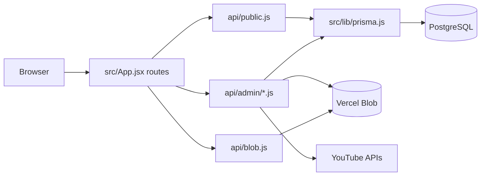

# Architecture

## Overview

A.S.D. is a client-rendered React application with Vercel serverless APIs. `src/main.jsx` mounts the React app, `src/App.jsx` defines the route tree, and Vercel rewrites in `vercel.json` route browser/API requests to either `index.html` or a function under `api/`.

## Client Layers

`src/App.jsx` wraps the app in `AdminProvider` from `src/lib/adminAuth.jsx` and `PlayerProvider` from `src/lib/playerContext.jsx`. Public routes share `PublicLayout`, which renders `Nav`, route content, `PublicLegalFooter`, and preview controls for logged-in admins.

Public pages use `src/hooks/useApi.js`, backed by `src/lib/apiCache.js`, for cached JSON fetches. Admin pages generally use `src/lib/adminResourceCache.js` for cached admin GET requests and direct `fetch` calls for writes.

## Server Layers

`api/public.js` is the public resource multiplexer. Friendly paths such as `/api/artists/:slug` and `/api/fashion/catalogue` are rewritten to it by `vercel.json`.

Admin endpoints live in `api/admin/`. They authenticate through `requireAdmin` or `requireSuperAdmin` from `src/lib/auth.js`, then enforce endpoint-specific page/role permissions. `src/lib/adminPageAccess.js` controls UI route visibility and contributes to server checks, but each admin API is the real permission boundary.

`src/lib/prisma.js` owns the Prisma client singleton. It is server-only in practice because it reads database connection configuration and is imported by API handlers.

## Data Access

The database schema is in `prisma/schema.prisma`. Public APIs select and format only the fields needed by public pages. Admin APIs read/write broader model shapes and often replace child collections wholesale, such as images, song placements, fashion pieces, look credits, and record-player slots.

Prisma migrations are not present in this checkout because the current database already represents the desired schema. Restore or recreate migration history if future production schema changes need a Prisma migration workflow.

## Auth Boundaries

Admin auth is cookie-based. `api/admin/login.js` signs a JWT with `JWT_SECRET` and writes it to an HttpOnly cookie named `asd_admin_token`. Client code stores only session metadata plus the sentinel token value `cookie`; `src/lib/auth.js` rejects that sentinel as a bearer token and falls back to the cookie.

Roles:

- `SUPER_ADMIN`: full CMS access.
- `ARTIST`: scoped to one music artist.
- `TALENT`: scoped to one fashion talent.
- `VIEWER`: read-only/public-ish access in selected admin views.

## Visibility Model

`src/lib/contentVisibility.js` and `src/lib/releaseSchedule.js` define release visibility. Records can be explicitly visible, explicitly hidden, or hidden with `autoShowOnRelease`. Release-day visibility uses the America/New_York day boundary.

Public reads compute effective visibility at request time. `api/admin/albums.js` and `api/admin/songs.js` also lazily materialize stale `isVisible` values after release.

## Storage Model

Uploads go through `api/admin/uploads.js`, which validates image type, file size, and folder. Private blob reads go through `api/blob.js`, which currently allows reads when the caller knows the pathname. This is intentional for the initial launch so normal public pages can display uploaded assets, but the future policy should explore admin-only storage access paired with public-safe delivery URLs or signed/proxied reads.

`src/lib/blobCleanup.js` performs best-effort cleanup after updates/deletes. It checks known database references before deleting Vercel Blob pathnames, logs failures, and does not fail the admin request if cleanup fails.

## External Services

- Vercel Blob: image upload, import, delete, and private read proxy.
- YouTube Data API and Google OAuth: Crosshair sync in `src/lib/youtubeChannelSync.js`.
- SoundCloud widget: global player in `src/lib/playerContext.jsx` and `src/components/shared/SoundCloudPlayer.jsx`.
- Spotify and Apple Music embeds: public playback widgets.
- Vercel Analytics: mounted in `src/main.jsx`.
- DaFont-sourced local fonts: loaded from `fonts/` through `src/styles/index.css`.

## Tradeoffs and Operational Decisions

- Public APIs send `Cache-Control: no-store`, while the browser caches responses in memory through `useApi`.
- Login has no application-level rate limiting yet and needs one before broader use.
- Private blob access relies on pathname secrecy for now; hardening this without breaking public image display is tracked in `FUTURE_FIXES.md`.
- Runtime admin-account schema capability checks supported a one-time migration; remove them if code search confirms no current callers need backward compatibility.
- `vercel.json` uses the `[deploy]` commit-message convention so ordinary commits can avoid official Vercel rebuilds and the operator can move branches without immediately changing the public build.
