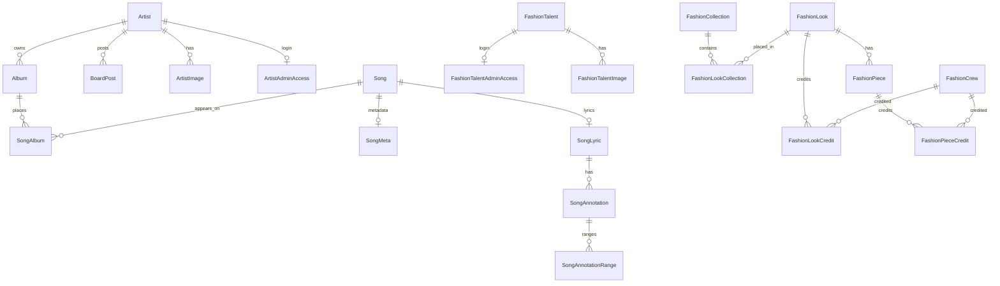

# Data Model

The schema lives in `prisma/schema.prisma`. This document summarizes model responsibilities and cross-model rules; the schema remains the source of field names and relation definitions.

## Music

- `Artist`: music artist profile, social/streaming links, images, albums, board posts, videos, and optional admin access.
- `MusicOutsideArtist`: outside/freelance music credit person. Some song/album credit saves can create these rows automatically.
- `Album`: release container. Has `type`, visibility fields, release links, roles, images, and `SongAlbum` placements. `EP` is intentionally treated like an album; in this project it means an album-length concept with fewer songs, not a separate release behavior.
- `Song`: track-level data, optional independent release links, images, lyrics, metadata, and record-player slots.
- `SongAlbum`: join model for song placements, track/disc numbers, and placement order.
- `SongMeta`: song about text, tags, BPM, key, release date, and roles.
- `SongLyric`, `SongAnnotation`, `SongAnnotationRange`: current lyric text, synced line data, and multi-range annotations.
- `LyricBlock` and `Annotation`: legacy lyric-block models. They can be removed after a schema/application audit confirms the current `SongLyric` and `SongAnnotation` models are the only active lyric system.
- `RecordPlayerTrack`: fixed-position records for the public record-player widget.
- `CrosshairVideo`: manual or YouTube-synced video entries for The Crosshair.
- `BoardPost`: public/admin board content, position data, publish/archive/expiry dates, and markdown body.

## Fashion

- `FashionTalent`: visible talent profile, links, agency fields, images, credits, created looks/collections, and optional admin access.
- `FashionCrew`: outside/freelance fashion credit person. Free-text credits can create these rows automatically.
- `FashionCollection`: collection or loose-look grouping with cover image, release date, location, credits, and look placements. Loose looks should now be represented by attaching the look to a collection whose type is `LOOSE`.
- `FashionLook`: lookbook entry with creator, collection placements, images, pieces, and credits.
- `FashionPiece`: item within a look, with image, buy URL, order, and credits.
- Credit models: `FashionCollectionCredit`, `FashionLookCredit`, and `FashionPieceCredit` can point to either `FashionTalent`, `FashionCrew`, or retain a display `creditName`. Free-text outside fashion credits intentionally auto-register `FashionCrew` rows so future reuse can preserve the same credit identity.

## Company/About

- `CompanyProfile`: singleton row with id `main`.
- `CompanyMember`: visible/sorted about-page member rows with optional image.

## Admin Accounts

- `ArtistAdminAccess`: music artist account credentials, active flag, name, and page access.
- `FashionTalentAdminAccess`: fashion talent account credentials, active flag, name, and page access.

Passwords are stored as scrypt hashes from `src/lib/passwords.js`. Account passwords must be unique across artist and fashion talent accounts and cannot match `ADMIN_PASSWORD`.

## Visibility Fields

Music releases and some public entities use:

- `isVisible`: raw stored visibility flag.
- `autoShowOnRelease`: whether hidden content should become visible automatically.
- `releaseDate`: date used to decide release-day visibility.

`src/lib/contentVisibility.js` computes effective visibility. `src/lib/releaseSchedule.js` defines release day using America/New_York midnight boundaries.

## Legacy Compatibility

Several models still carry legacy single-string image/link fields:

- Artist `portrait`
- Album `coverArt`
- Song `artwork`
- Per-platform artist/fashion/release link columns

`src/lib/images.js` and `src/lib/profileLinks.js` bridge old and new representations. Do not remove these fields without auditing public/admin formatters and existing data.

The goal is to remove legacy compatibility paths and conform to the newest database representation once the data and call sites are fully migrated.

## Deletion Behavior

Many relations cascade in Prisma, especially images, songs/albums placements, lyrics, credits, looks/pieces, and admin-access rows. API handlers that delete image-owning records collect blob pathnames before deleting database rows so `src/lib/blobCleanup.js` can remove unused Vercel Blob objects afterward.

Blob cleanup is best effort and non-transactional.
